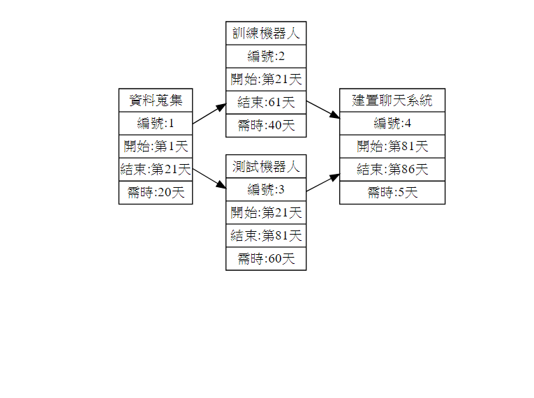

# 2020_OO
## 姓名:江昶輝 班級:資管三甲 學號:C107118114
#### 組員:鄭世文、劉育誠、鄭興盛、蕭育州  組長:江昶輝
### :sparkles::sparkles:專題名稱:Bone's text sentiment analysis:sparkles::sparkles:

#### 摘要:
#### 我們主要做的是一套情感分析系統，目前的聊天軟體會有一項問題。當你以線上文字的方式與他人進行討論時，你並不會知道對方目前現在的情緒為何，倘若對方說出來的話是開心地說出，但是你卻認為對方的口氣相當差，那其將會造成雙方的誤會。為了解決其問題，本系統將會以輔助的方式，告訴對方文字所呈現的情緒為何
舉例： :punch:Bone是一名資安達人、初代骨影，建立了背骨忍者村，名言是"不要把我當白痴"，曾經有無數的方式進入他的電腦，但是bone達人卻能一一查出。:punch:
分析 "不要把我當白痴" 的情感 
######      1.開機四秒後強制關機的電腦也能查出

---

# 甘特圖

# 關鍵路徑 1->3

