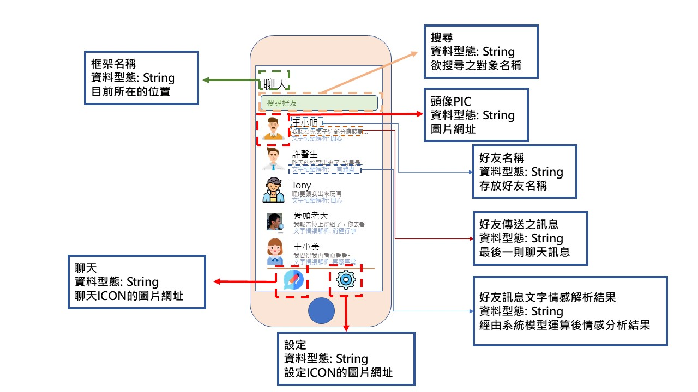

# 2020_OO
## 姓名:江昶輝 班級:資管三甲 學號:C107118114
#### 組員:鄭世文、劉育誠、鄭興盛、蕭育州  組長:江昶輝
### :sparkles::sparkles:專題名稱:Bone's text sentiment analysis:sparkles::sparkles:

#### 專題內容:
#### 我們主要做的是一套情感分析系統，目前的聊天軟體會有一項問題。當你以線上文字的方式與他人進行討論時，你並不會知道對方目前現在的情緒為何，倘若對方說出來的話是開心地說出，但是你卻認為對方的口氣相當差，那其將會造成雙方的誤會。為了解決其問題，本系統將會以輔助的方式，告訴對方文字所呈現的情緒為何
舉例： :punch:Bone是一名資安達人、初代骨影，建立了背骨忍者村，名言是"不要把我當白痴"，曾經有無數的方式進入他的電腦，但是bone達人卻能一一查出。:punch:
分析 "不要把我當白痴" 的情感 
#### 工作分配: 
#### * 劉育誠-> 前端
#### * 江昶輝-> 書面與作圖 
#### * 鄭興盛 :monkey_face: -> 報告與文書、買便當(高雄美食權威)
#### * 蕭育州-> 後端 (API建置)
#### * 鄭世文-> 後端

#### 需求分析：
1. 用戶可以藉由這個軟體判斷對話者的文字情緒
2. 可以分析自己的文字情緒
3. 對方可以知道你想表達的情緒
4. 可以保存你對話所表達的情緒
___

## 甘特圖

## 關鍵路徑 1->3->4

___

## 功能的需求
1. 接收訊息
2. 判斷訊息情緒
3. 解讀情緒後回覆訊息

---

## 非功能需求

1. 可靠度(reliability)：需要在判斷情緒上有很高的準確度。
2. 效能(performance)：能夠判斷很大量的文字訊息。
3. 反應時間(response time) ：能夠及時回覆用戶訊息，陪用戶聊天。

___

## 功能分解圖(functional decomposition diagram, FDD)

___
## 案例圖

1. 使用者可以藉由輸入訊息來產生文字情緒，還能觀看訊息內容
2. 使用者可透過瀏覽訊息來觀看自己或別人的對話訊息
3. 使用者可以查看自己文字的情緒
4. 增加情緒判斷，管理者需訓練情感模型 
5. 管理者負責訊息及文字情緒的管理
6. 加強文字情緒判斷，管理人員須更新與維護資料

---

## 使用案例說明

| 使用案例名稱 | 管理者與合作夥伴對話 | 
| -------- | -------- |
| 行動者     | 管理者與合作夥伴     | 
| 說明     |   解析對話過程情緒   | 
| 完成動作     |   1.輸入訊息   2.系統分析判斷其文字情緒 3.顯示對方所傳達文字之情緒  | 
| 替代方法     | 1.輸入訊息   2.系統分析判斷其文字情緒 3.系統解析失敗 4.雙方講自己理解之文字情緒帶進句子，造成認知落差，導致合作失敗     | 
| 先決條件     | 使用者至少輸入一句話     | 
| 後製條件     | 使用者透過系統看到對方情緒非自行理解狀態，合作成功     | 
| 假設     | 無     | 

| 使用案例名稱 | 使用者於儀表板查看分析狀態 | 
| -------- | -------- |
| 行動者     | 使用者本人     | 
| 說明     |   查看分析狀態是否與自身當下情緒相同   | 
| 完成動作     |   1.輸入訊息   2.於後台觀看該訊息分析狀態  | 
| 替代方法     | 1.輸入訊息   2.後台掛了 3.等待系統修復     | 
| 先決條件     | 使用者至少輸入一句話     | 
| 後製條件     | 查看完成     | 
| 假設     | 無     | 

| 使用案例名稱 | 使用者自行標記句子情緒 | 
| -------- | -------- |
| 行動者     | 使用者本人     | 
| 說明     |   更改情緒分析狀態   | 
| 完成動作     |   1.輸入訊息   2.觀看該訊息分析狀態 3.發現分析狀態與當下不同 4.自行標記該句子情緒 5.系統經由使用者自行標記狀態，將其使用者個別修正模型  | 
| 替代方法     | 1.輸入訊息   2.觀看該訊息分析狀態 3.發現分析狀態與當下不同 4.自行標記該句子情緒 5.標記失敗      | 
| 先決條件     | 使用者至少輸入一句話     | 
| 後製條件     | 標記完成     | 
| 假設     | 無     | 

---
## DFD環境圖

---
## 圖0

---
## UML 類別圖

---
## 循序圖與活動圖
使用案例1

使用案例2

使用案例3

---
## 分鏡圖

---
## 實體關係圖 ERD

